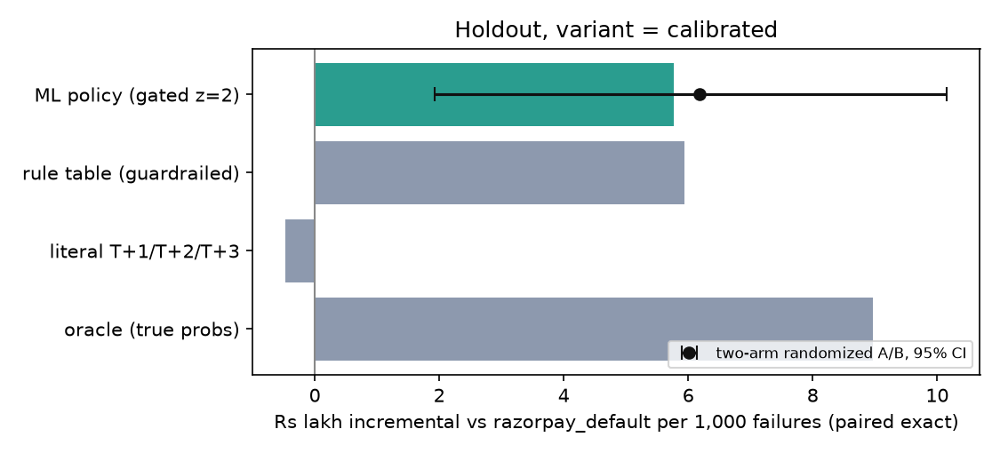
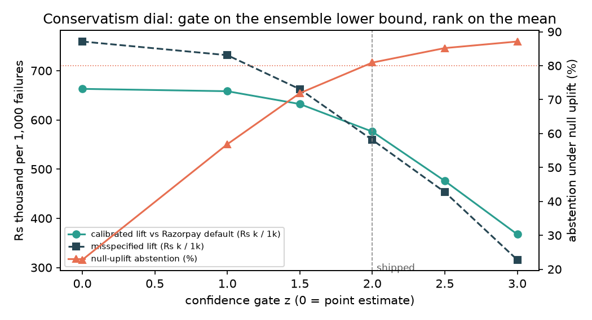

# Counterfact

Net-expected-value recovery of failed subscription payments for Razorpay merchants.
**"Do nothing" is a first-class action with its own expected value.**

Razorpay AI Buildathon 2026, AI Revenue Recovery track.

> Status: Phase 2 (models, policy, guardrails, A/B, sensitivity) complete. Every number in this README is regenerated by `make data && make train && make eval` (plus `make dial`, `make sensitivity`).

## Phase 2 results: ML policy vs Razorpay default (20k-failure holdout per variant)
The policy predicts the incremental recovery probability of each arm with a T-learner (one
LightGBM per action, 10-member bootstrap ensemble, trained on logged data with recorded
propensities), prices it against message cost, ops cost and contact fatigue, **acts only when the
ensemble lower confidence bound of some arm's net EV clears the merchant threshold** (gate z = 2),
and then runs the choice through hard guardrails. `razorpay_default` is Razorpay's automatic
retry schedule and, under the equalized attempt budget (ADR-006), is exactly our `retry_delayed(1)`
action, so no lift below comes from extra attempts.

| variant | policy | Rs incr vs razorpay_default /1k | Rs incr vs no_action /1k | recovery delta | raw recovery | abstention | contacts /1k | wasted contacts /1k | escalations /1k |
|---|---|---|---|---|---|---|---|---|---|
| calibrated | **ml_policy** | **576,174** | 3,006,553 | **+5.7%** | 65.2% | 13.0% | 127 | 28 | 234 |
| calibrated | razorpay_default | 0 | 2,430,380 | +0.0% | 59.5% | 0.0% | 0 | 0 | 0 |
| calibrated | heuristic (guardrailed rule table) | 594,178 | 3,024,558 | +8.1% | 67.6% | 6.6% | 342 | 106 | 207 |
| calibrated | oracle (true probabilities) | 896,241 | 3,326,621 | +10.9% | 70.5% | 0.0% | 174 | 61 | 279 |
| misspecified | **ml_policy** | **559,383** | 2,721,382 | **+6.1%** | 64.1% | 15.8% | 58 | 16 | 227 |
| misspecified | razorpay_default | 0 | 2,161,999 | +0.0% | 58.0% | 0.0% | 0 | 0 | 0 |
| misspecified | heuristic | 641,365 | 2,803,364 | +9.5% | 67.4% | 6.6% | 342 | 107 | 207 |
| misspecified | oracle | 977,449 | 3,139,448 | +12.8% | 70.8% | 0.0% | 213 | 77 | 290 |
| null_uplift | **ml_policy** | -202 | -202 | -0.0% | 23.4% | **80.9%** | 4 | 1 | 121 |
| null_uplift | razorpay_default | 0 | 0 | +0.0% | 23.5% | 0.0% | 0 | 0 | 0 |
| null_uplift | heuristic | -10,399 | -10,399 | -0.1% | 23.3% | 6.6% | 342 | 106 | 207 |

Two-arm randomized A/B (`ml_policy` vs `razorpay_default`, ~10k units per arm, 95% bootstrap CI):
calibrated **+617,938** [192,676; 1,015,642]; misspecified **+537,563** [102,053; 914,654];
null_uplift -16,475 [-301,636; 288,010].

What the table says: the policy beats Razorpay's default by 5.7-6.1 recovery points (about Rs 5.8
lakh per 1,000 failures on this portfolio) with a significant A/B; it ties the rule table on
rupees while sending 63-83% fewer reminders and wasting 74-85% fewer; and in a world where no
intervention works it abstains on 81% of failures (the rest are guardrail-mandated escalations)
and loses nothing, where the rule table keeps sending 342 reminders per 1,000. The rule table is
an oracle-informed competitor: it was written with knowledge of the simulator's true per-category
probabilities, which no merchant has. The `drifted` variant (merchants whose failures depart from
the taxonomy) is where the two are expected to separate.

The confidence gate is a dial (`make dial`, `reports/figures/z_dial.png`): the plain point
estimate earns 13-26% more when uplift is real but intervenes on 77% of failures when it is not.
A sensitivity sweep over every simulator assumption that moves the headline (19 settings,
`make sensitivity`) keeps the ranking oracle >= ML > Razorpay default in all of them; details,
per-merchant tables and guardrail activity in `docs/EVALUATION.md`.

**Off-policy evaluation (Phase 3).** From logged data alone (recorded propensities), the
doubly-robust estimate of each policy's value lands within 0.6-3.2% of the paired-exact truth on
rupees for the ML policy, the rule table and Razorpay default under every variant, and its
difference vs Razorpay default sits inside the randomized A/B interval in 9 of 9 cells; plain
IPS drifts by up to 13% where the target policy rarely matches the logged action. Table:
`python scripts/ope.py --all-variants`, `docs/EVALUATION.md`.




## Phase 4: the agent, end to end (`make demo`)
`python scripts/run_batch.py --n 500 --inject-failure` processes 500 held-out failures through
decide -> guardrails -> idempotent executor -> audit, with a provider 5xx injected mid-batch:

```
batch of 500 failures (calibrated) processed in 5.0s
  recovered: 307/500 = 61.4%   Rs recovered 1,824,718 of Rs 2,755,429 at risk
  contacts 61  escalations 129  abstentions 49  guardrail overrides 45
  executor ledger {'executed': 451, 'skipped': 49}  injected 5xx fired 3  queued mid-batch 1  re-driven 1
  duplicate charges: 0  (events charged more than once; must be 0)
```

Every decision is one audit row (`event_id, idempotency_key, features_hash, uplift[5], net_ev[5],
chosen_arm, guardrail_checks[], reason, executor_result, outcome, explanation`) in an append-only
JSONL file with a SQLite mirror. The idempotency key is reserved in the ledger before any provider
call, so a replayed webhook or a re-driven queued action can never charge twice (tested). Claude
(`claude-haiku-4-5`) drafts two-sentence explanations lazily (`--explain N`, capped at 50 per run,
cached); a validator rejects any text naming an arm outside the action set and falls back to a
deterministic template. `RazorpayExecutor` maps the arms to test-mode endpoints
(`payment.createRecurring`, `invoice.notify_by`, `subscription.fetch`, webhook HMAC); see
`docs/ARCHITECTURE.md` for the limitation that test mode cannot emit the failure taxonomy.

## Phase 1 results: baselines under three simulator variants
Per 1,000 failed payments, seed 42, 50,000 failures. `razorpay_default` is Razorpay's automatic
retry schedule after a failed subscription charge; under the equalized attempt budget (ADR-006)
it is exactly our `retry_delayed(1)` action (attempts at days 1, 3, 5), calibrated to the public
55-65% recovery band under `calibrated` and inside it under `misspecified` without re-tuning.
Under `null_uplift` no intervention has any causal effect, so the right answer is to abstain.

| variant | policy | raw recovery | Rs recovered /1k | Rs incr. vs no_action /1k | contacts /1k | wasted contacts /1k | escalations /1k |
|---|---|---|---|---|---|---|---|
| calibrated | no_action | 23.9% | 2,146,287 | 0 | 0 | 0 | 0 |
| calibrated | razorpay_default | 60.0% | 4,514,448 | 2,368,161 | 0 | 0 | 0 |
| calibrated | heuristic | 68.4% | 5,077,412 | 2,931,125 | 450 | 140 | 179 |
| misspecified | no_action | 23.1% | 2,324,649 | 0 | 0 | 0 | 0 |
| misspecified | razorpay_default | 58.0% | 4,481,552 | 2,156,902 | 0 | 0 | 0 |
| misspecified | heuristic | 67.9% | 5,081,791 | 2,757,142 | 450 | 142 | 179 |
| null_uplift | no_action | 23.9% | 2,146,287 | 0 | 0 | 0 | 0 |
| null_uplift | razorpay_default | 23.9% | 2,146,287 | 0 | 0 | 0 | 0 |
| null_uplift | heuristic | 23.7% | 2,127,730 | -18,556 | 450 | 140 | 179 |

Regenerate: `make data && python scripts/checkpoint1.py`. Methodology and calibration:
`docs/EVALUATION.md`.

## Run
```bash
make setup     # uv sync (Python 3.11, pinned)
make data      # 50k failures x 3 simulator variants
make train     # uplift models
make eval      # A/B + OPE -> reports/
make demo      # 500-failure batch with one injected 5xx
make test
```
Windows without GNU make: `.\make.ps1 <target>`.

## Layout
See `CLAUDE.md` for the architecture diagram and `docs/` for decisions, architecture, evaluation and the demo script.
